# WuPilot — Windows Update Workbench

WuPilot is an elevated WinUI 3 desktop application for support technicians who need to inspect Windows Update behavior on one device, compare update sources, test a selected update, and hand useful driver evidence to an Intune administrator.

The application uses the supported Windows Update Agent (WUA) COM API. Microsoft’s published script is a demonstration rather than production code; WuPilot wraps the same object model with serialized operations, error isolation per provider, explicit confirmations, normalized evidence, diagnostics, and recoverable repair actions.

## Current capabilities

- Scan one or several sources in sequence:
  - policy default
  - managed WSUS
  - public Windows Update
  - Microsoft Update
  - Microsoft Store service
  - a custom registered WUA service GUID
  - a Microsoft-signed offline `Wsusscn2.cab` security catalog
- Use safe presets for missing drivers, missing software, installed, hidden, all applicable, or advanced WUA criteria.
- Save reusable scan profiles that remember providers, criteria, supersedence, custom service IDs, and offline catalog paths.
- Compare/deduplicate results by WUA UpdateID and revision while retaining every source that offered the update.
- Compare the latest two scans to identify newly offered, removed, revised, and state-changed updates.
- Retry only failed providers without repeating successful source scans.
- Inspect title, description, KB/CVE IDs, categories, sizes, install state, severity, reboot behavior, and detailed driver metadata.
- Search, sort, and filter scan results by text, update kind, state, size, date, severity, and restart requirement.
- Correlate an offered driver to the currently installed signed PnP driver using exact/family hardware identifiers, including current version/date, INF, signer, and match confidence.
- Track selected updates in a persistent watchlist and see whether each one is still offered after a later scan.
- Browse and filter up to 500 local Windows Update history events, including failures and HRESULT values.
- Inspect and change more than 45 Windows Update and Delivery Optimization settings through an audited policy workbench with build gating, requested/effective state, transactional rollback, and MDM-aware ownership.
- Review Delivery Optimization CDN, cache, peer, upload, and mode statistics alongside retained WuPilot download/install timings and clearly labeled Windows event estimates.
- Check stable GitHub releases from the installed app, verify the architecture-specific installer against two SHA-256 sources, and start an in-place upgrade only after confirmation.
- Restore the previous window, page, appearance, scan setup, and useful filters without reopening stale scan evidence or pending policy changes.
- Follow long operations from any page through global progress, elapsed time, cancellable safe-close behavior, taskbar status, and a retained completion center.
- Inspect every registered WUA source and reuse its service GUID for a custom read-only scan without registering or changing services.
- Download, install, hide, or show one revalidated update with a confirmation. WuPilot never restarts the device automatically.
- Diagnose update services, registered WUA sources, Windows Update/MDM policy registry values, WinHTTP proxy, Microsoft content DNS, WUA version/history, BITS jobs, disk space, Entra join identity, and pending restart state.
- Start required services, run DISM health operations, generate `WindowsUpdate.log`, or reset update caches. Cache reset renames existing stores to timestamped recovery paths rather than deleting them.
- Export one or several selected update records, technician notes, JSON, CSV, and a human-readable HTML review bundle plus Windows Update events, CBS errors, SetupAPI driver-install evidence, BITS state, and existing SetupDiag results.

## Install

WuPilot is Windows-only and supports Windows 10 version 1809 or newer.

Download the latest installer from [GitHub Releases](https://github.com/retsak/WuPilot/releases):

- choose `win-x64` for Intel and AMD 64-bit PCs;
- choose `win-arm64` for Windows on Arm.

Run the installer, accept the Windows elevation prompt, and start WuPilot from the Start Menu. The installer is self-contained: users do not need the .NET SDK, Windows App SDK, Visual Studio, or a source checkout.

The installer supports in-place upgrades, uninstall through Windows Settings, automatic light/dark appearance, an optional desktop shortcut, and silent deployment. Its default **Automatically check for stable WuPilot updates** option enables a non-background daily check while WuPilot is open; About always offers a manual check. Until a trusted code-signing certificate is configured for the project, Windows may identify the publisher as unknown or display a SmartScreen warning. Release checksum files are provided for integrity verification.

For unattended installation:

```powershell
WuPilot-0.3.0-win-x64-setup.exe /VERYSILENT /SUPPRESSMSGBOXES /NORESTART
```

WuPilot requests administrator rights because some WUA methods, diagnostics, service controls, and repair tools require elevation.

## Build from source

Developers can build WuPilot on Windows with the .NET 10 SDK and Windows application development tooling installed.

```powershell
git clone https://github.com/retsak/WuPilot.git
cd WuPilot
./scripts/Build-WuPilot.ps1 -Platform x64 -Configuration Release
./artifacts/WuPilot-win-x64/WuPilot.exe
```

To build a distributable installer locally, install Inno Setup 7 and run:

```powershell
./scripts/Build-WuPilotInstaller.ps1 -Platform x64 -Version 0.3.0
```

Release and signing details are documented in [`docs/RELEASING.md`](docs/RELEASING.md).

After launch:

1. Leave **Policy default** selected for the first scan.
2. Choose a search profile. **Missing drivers** is a useful starting point for driver troubleshooting.
3. Select **Start scan**. Scanning is read-only and may take several minutes.
4. Use the search, state filter, and sort controls to narrow the results. You can select several updates for export, but device-changing actions remain limited to one selected update.
5. Select an offered update to review its source, identity, applicability, driver match, signer, version, and date. Add it to the **Watchlist** if you need to follow it across later scans.
6. Add optional technician notes and export an evidence bundle for review.
7. Use **Download**, **Install**, **Hide**, or **Show** only after reviewing one selected update. Each action requires a separate confirmation and defaults to **Cancel**; WuPilot never restarts the device automatically.

To compare sources, select **Windows Update**, **Microsoft Update**, or **Microsoft Store service** and scan again. A source must already be registered with Windows Update Agent; WuPilot does not register services during a read-only scan.

Use **Save current** to keep a provider-and-criteria combination as a reusable scan profile. After two scans, open **Compare scans** to review what changed. If one source failed, use **Retry failed sources** to preserve successful results and re-query only the failures.

The **Registered sources** tab is a read-only inventory of WUA services already present on the device. Selecting a source can populate the custom service field for a later scan; it never calls WUA service-registration methods. **Update history** provides a searchable view of local install history, while **Watchlist** tracks whether chosen updates remain offered.

For a control-by-control description of scanning, comparison, watchlists, diagnostics, history, exports, and single-update actions, see the [feature guide](docs/FEATURES.md).

### Update controls and policy workbench

Open **Update controls** to refresh current Windows Update and Delivery Optimization policy. Quick controls cover Microsoft product updates, continuous innovation, metered downloads, restart notifications, and pause/resume. The workbench exposes requested and effective values, ownership, Windows-build support, documented choices, and local editability.

Every change requires confirmation. WuPilot snapshots the original registry value, applies and verifies the entire batch, and rolls back partial changes on failure. The durable audit can be exported or used to restore a prior value. MDM-only CSP settings are evidence-only; domain or MDM management can overwrite a permitted local request. Private Windows Settings mappings are explicitly identified and build-gated.

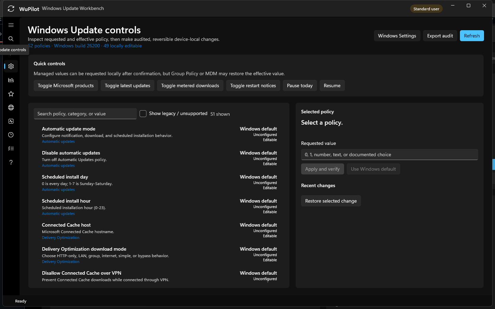

### Performance and Delivery Optimization

**Performance** combines supported `Get-DeliveryOptimization*` telemetry with retained update-action timings. WuPilot-created action totals use a monotonic timer and are marked **Exact**. WindowsUpdateClient event pairs are marked **Low** confidence; missing event boundaries never produce an invented duration. For a WuPilot install that reports a required restart, a later launch can correlate normal shutdown and boot events and records the relationship as **Medium** confidence without installing a service or startup task.

Operation metrics are retained for up to 365 days or 5,000 entries under `%LocalAppData%\WuPilot`. Delivery Optimization statistics cover HTTP/CDN, Connected Cache, LAN/internet peers, uploaded bytes, cache size, active work, mode, and bandwidth limits when the Windows module exposes them.

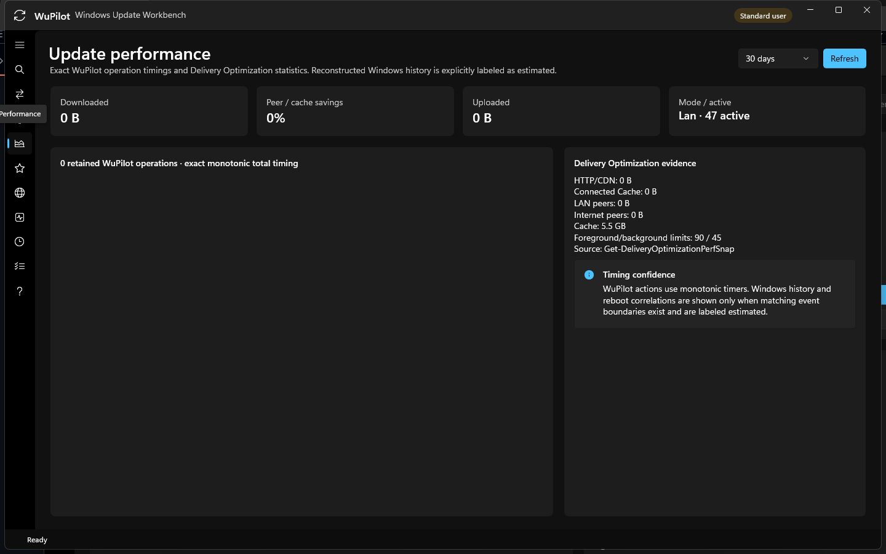

### Application updates

WuPilot checks `retsak/WuPilot` stable releases at most once every 24 hours while the app is running. It ignores drafts and prereleases, selects only the native x64 or ARM64 installer, and requires the downloaded SHA-256 to match both GitHub's asset digest and the release checksum sidecar. A signed installer must have a valid Authenticode status; an unsigned but hash-valid installer receives an additional warning. WuPilot never downloads or installs an update without confirmation.

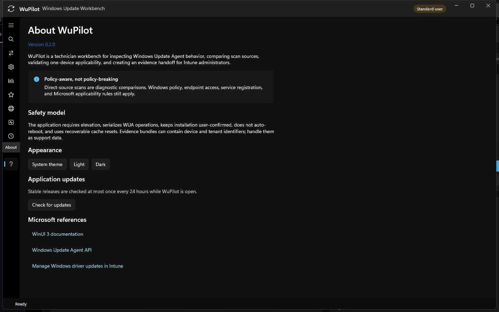

### Workflow preferences and keyboard navigation

WuPilot saves a versioned per-user workflow preference file under `%LocalAppData%\WuPilot`. It restores visible window placement, navigation page, theme, scan setup, result sort/filter, performance range, policy filters, favorites, and the taskbar-attention preference. Window coordinates are clamped to a visible monitor. Scan results, selected updates, technician notes, and staged policy changes are deliberately never restored.

Use **Ctrl+1**, **Ctrl+2**, and **Ctrl+3** for Scan, Update controls, and Performance. **Ctrl+F** focuses the active page search, **F5** refreshes the active read-only page, **Ctrl+Enter** starts a scan, **Esc** requests supported cancellation, and **Ctrl+Shift+E** exports available evidence. Shortcuts never bypass a policy or update confirmation.

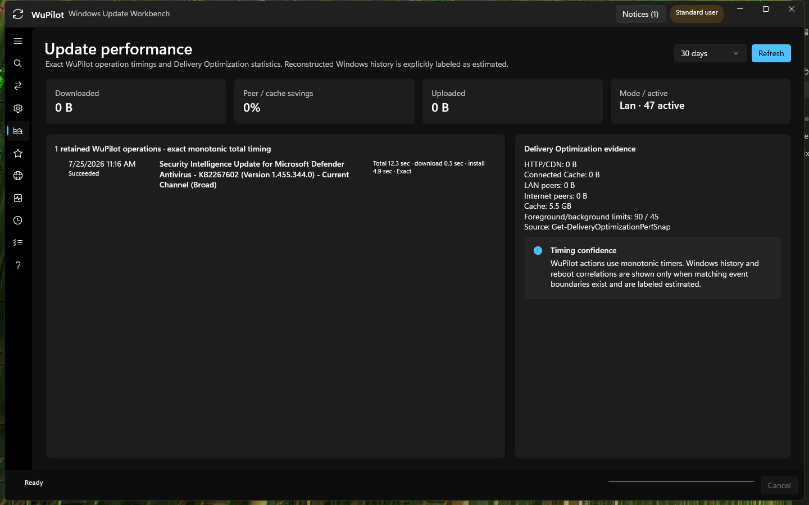

### Global operation progress and completion center

Scanning, diagnostics, repair, export, update actions, and application downloads report their originating page, stage, percentage, and elapsed time in the global footer. The Windows taskbar mirrors determinate, indeterminate, paused, and failed states. Because WuPilot runs elevated and elevated Windows App SDK notifications are unsupported, completion notices stay in WuPilot and taskbar attention is used only when the window is not focused.

Closing during an operation offers to keep running or request cancellation. WuPilot waits for the current safe WUA or repair boundary and never terminates a synchronous servicing call mid-operation.

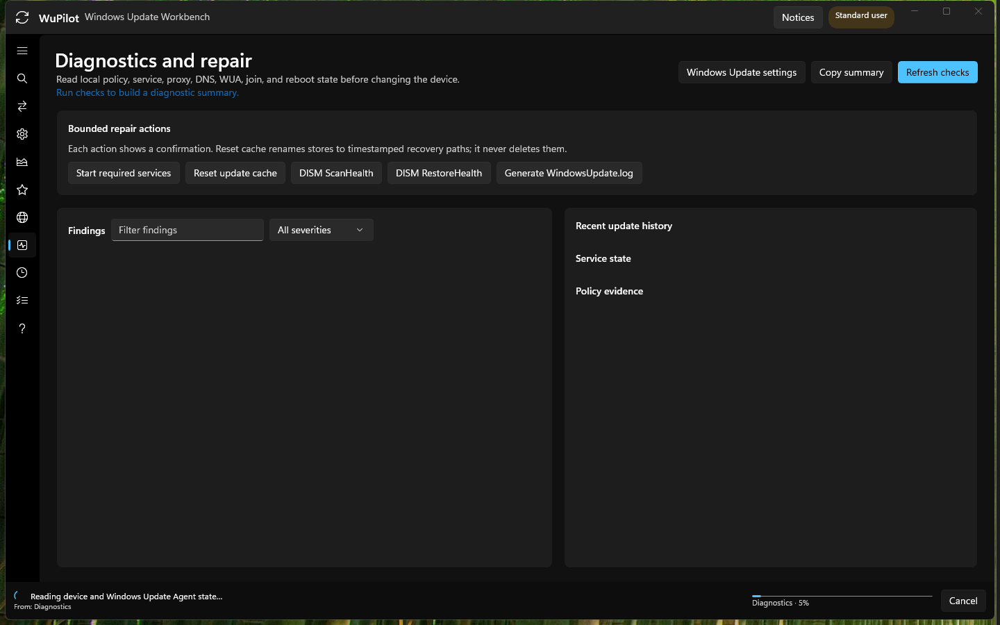

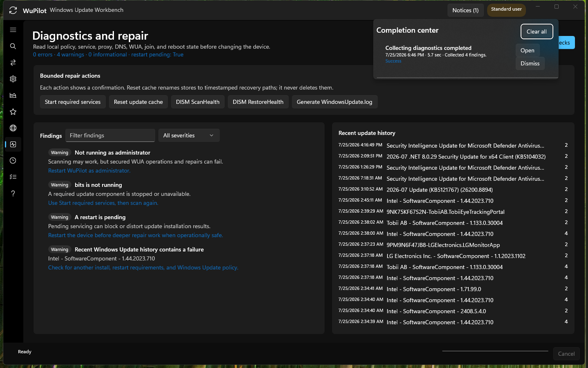

### Policy favorites and transactional change cart

The policy workbench now includes persistent favorites, category/ownership/risk/state filters, requested-versus-effective filtering, and type-specific editors. Boolean, choice, bounded numeric, date, and text values are validated before staging. Quick controls stage changes as well.

The session-only cart displays before/after values, risk, ownership, restart requirements, and management warnings. Applying the cart rechecks the requested values captured during staging and rejects drift before writing. The complete batch is still snapshotted, applied, verified, audited, and rolled back together on failure.

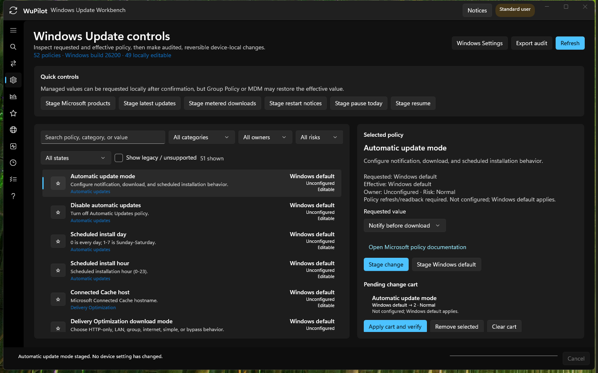

Use `-Platform ARM64` for native ARM64. The full release gate is documented in [`docs/WINDOWS-VALIDATION.md`](docs/WINDOWS-VALIDATION.md), and `scripts/Test-WuaReadOnly.ps1` provides a non-mutating WUA smoke test independent of the UI.

### 1. Start with the safe defaults

Policy default and the missing-driver search profile are selected at startup. Provider shortcuts make it easy to switch between policy-only and direct Microsoft comparisons. Saved profiles can restore sources, criteria, supersedence, custom service IDs, and offline catalog paths. Download and Install remain unavailable until one applicable update is selected.

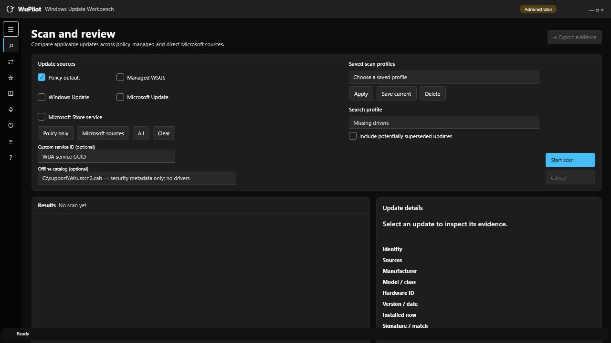

### 2. Review scan insights and narrow the results

After a scan, WuPilot summarizes update kinds and state, known download size, restart exposure, duration, and source health. Search matches titles, sources, KBs, and CVEs; filters isolate drivers, software, installed, downloaded, hidden, or restart-required updates. Sorting supports title, size, deployment-change date, and severity. Multi-selection is available for export, while device-changing actions remain limited to one reviewed update.

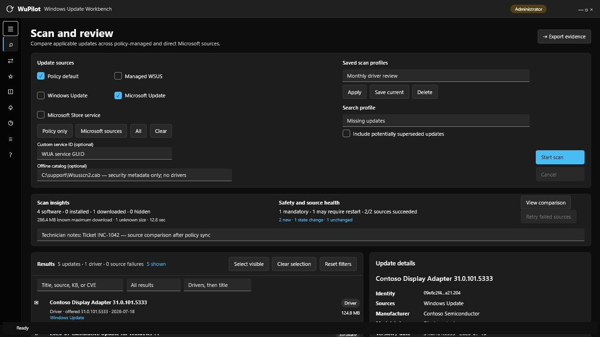

### 3. Preserve partial results and retry only failed sources

Provider failures are retained alongside successful results. If Microsoft Update is not registered, WuPilot explains the condition and leaves registration unchanged instead of silently opting in the device. **Retry failed sources** re-queries only failures and merges the retry with results from sources that already succeeded.

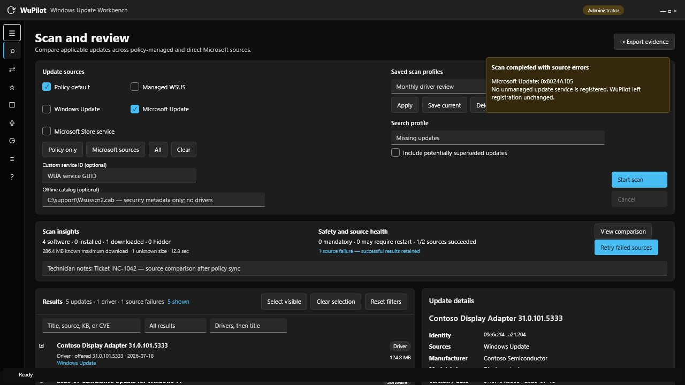

### 4. Compare the two most recent scans

**Compare scans** separates newly offered, no-longer-offered, revised, and state-changed updates while counting unchanged records. WuPilot also warns when the sources or criteria differ, because that context can explain apparent additions and removals. Comparisons are session-only and do not change update state.

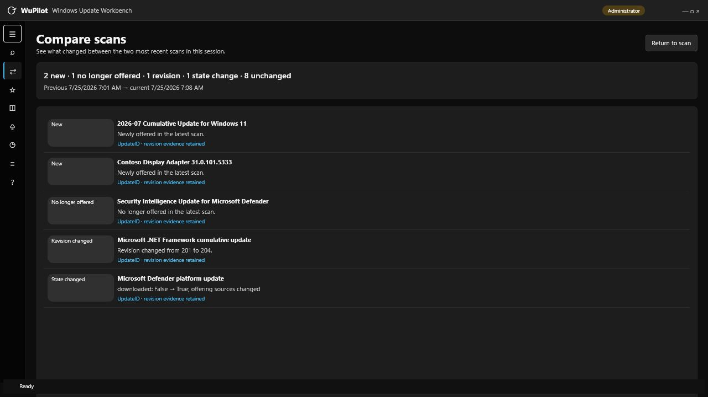

### 5. Track important updates

The persistent **Watchlist** records UpdateID/revision, source, state, and driver version/date. A later scan marks each item as still offered or no longer offered without downloading, installing, hiding, approving, or deploying it.

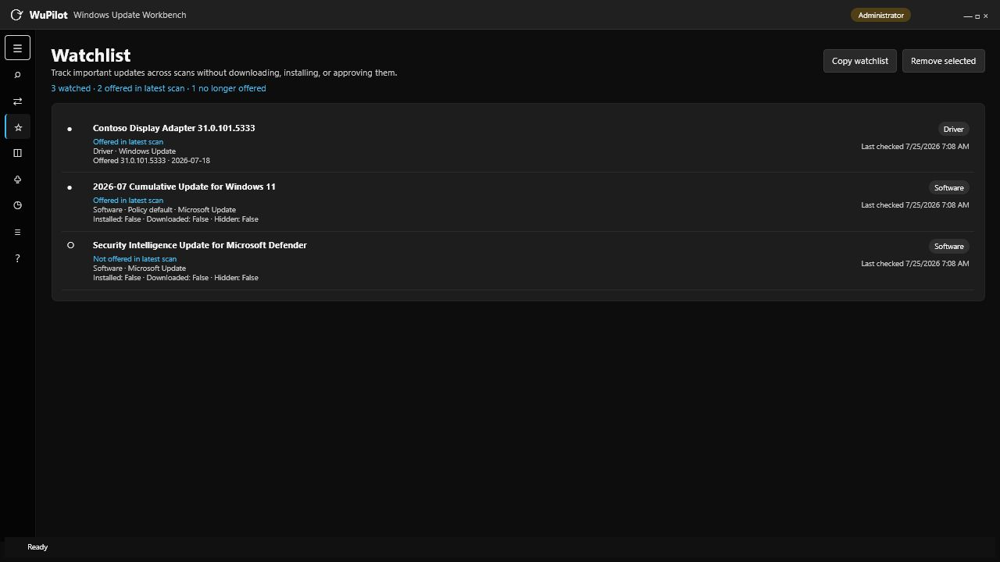

### 6. Inventory registered WUA sources

**Registered sources** shows each existing WUA service GUID, management/default role, scan-package status, and Windows-update capability. **Use for custom scan** copies the selected GUID into the scan setup; it does not register a service or change the Automatic Updates default.

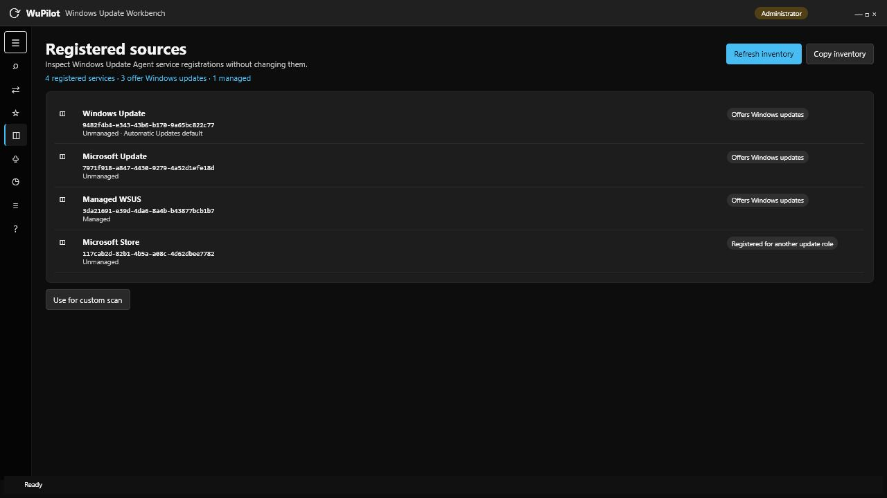

### 7. Inspect diagnostics before making changes

Open **Diagnostics** and select **Refresh checks** to review findings, history, services, and policy evidence. Findings can be searched, filtered by severity, and copied.

Repair buttons are intentionally separate from diagnostics. Each action displays a confirmation first. Cache reset renames existing stores to recoverable timestamped paths, and WuPilot does not restart the device automatically.

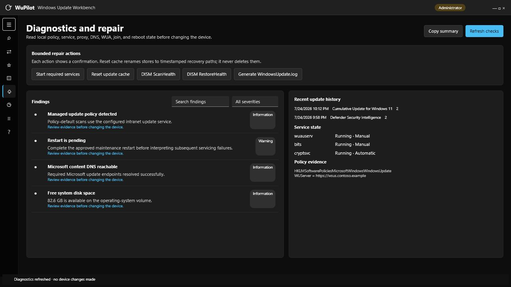

### 8. Search local update history

**Update history** reads up to 500 recent WUA operations without starting a scan. Search by title, HRESULT, source, or UpdateID, and isolate failures or partial results for troubleshooting.

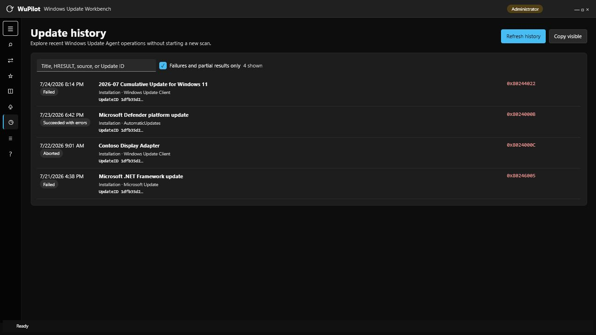

### 9. Review session activity

**Activity** records scans, retries, diagnostics, repairs, exports, watchlist changes, and action results for the current session. Copy it for a quick ticket note; export an evidence bundle when a durable support record is required.

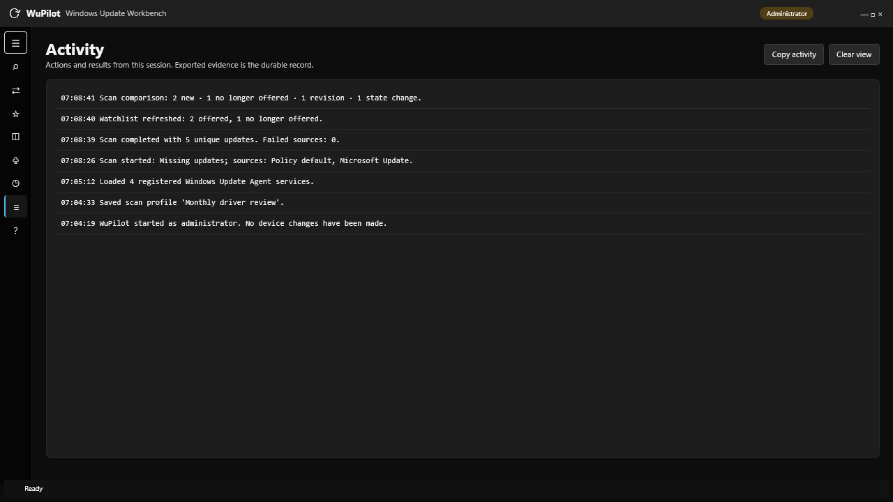

### 10. Review safety boundaries and appearance

**About** explains WuPilot's policy boundaries and safety model, links to the relevant WinUI, WUA, and Intune documentation, and provides system, light, and dark appearance controls.

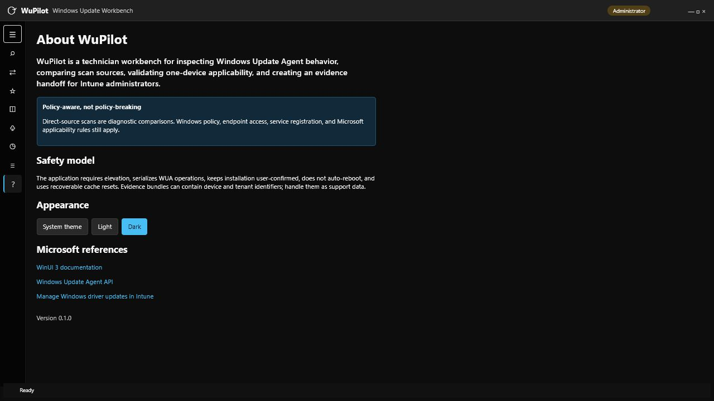

## Build and test

For an iterative developer build:

```powershell
dotnet restore WuPilot.slnx
dotnet test tests/WuPilot.Core.Tests/WuPilot.Core.Tests.csproj
dotnet build src/WuPilot.App/WuPilot.App.csproj -p:Platform=x64
dotnet run --project src/WuPilot.App/WuPilot.App.csproj -p:Platform=x64
```

For a tested self-contained output, use `scripts/Build-WuPilot.ps1`; the result is written under `artifacts/`. For a complete installer, use `scripts/Build-WuPilotInstaller.ps1`.

## Technician workflow

1. Run diagnostics before changing anything. Save policy-related findings rather than immediately “fixing” intentional management settings.
2. Scan **Policy default** first to capture the managed experience.
3. Save the scan setup as a profile when it will be reused for the same device class or support playbook.
4. For comparison, add **Windows Update**, **Microsoft Update**, or **Microsoft Store service**. Use the missing-driver preset with Windows Update to query applicable driver metadata. A direct-source scan does not defeat policy, endpoint restrictions, or Microsoft applicability rules.
5. Open **Compare scans** after another scan to distinguish newly offered updates from provider or state changes.
6. Inspect driver manufacturer, provider, model, class, hardware ID, date, inferred version, and source.
   Compare the installed driver match and confidence before concluding the offered package is an upgrade for the intended device.
7. Add important updates to the watchlist, include ticket context in technician notes, and export evidence.
8. Optionally download or install on this single test device after the confirmation. Re-scan afterward.
9. Send the evidence bundle to the Intune administrator.
10. In Intune, match on name, manufacturer, version/date, class, and applicable devices. Use a deployment ring before broad approval.

## Intune identity caveat

WUA UpdateID/revision values are excellent local trace identifiers, but they are not guaranteed to equal the Intune `windowsDriverUpdateInventory.id`. WuPilot therefore retains WUA identity and also emits the visible fields used to find and validate the same driver in Intune. Driver version is inferred from the catalog title because the WUA driver interface exposes version date but no standalone version-string property; confirm it in Intune.

## Safety boundaries

- All WUA operations are serialized. A synchronous provider search may take time and cannot always be interrupted immediately.
- Custom criteria are length-checked and reject control characters/statement separators; WUA still performs final syntax validation.
- Installation is one update at a time, applicability is rechecked, possible interactive installers are refused, and license acceptance is explicit in the confirmation.
- No automatic restart, policy mutation, driver approval, tenant write, or silent mass deployment occurs.
- Evidence can contain device serial number, Entra device ID, tenant ID, policy data, and hardware IDs. Handle it as support data.
- Offline `Wsusscn2.cab` scans cover Microsoft security applicability metadata; Microsoft documents that the catalog contains no driver metadata or update binaries.

## Project layout

- `src/WuPilot.Core` — models, criteria, merge rules, HRESULT guidance, abstractions.
- `src/WuPilot.Infrastructure.Windows` — WUA COM adapter, device diagnostics, repairs, evidence export.
- `src/WuPilot.App` — elevated WinUI 3 user interface.
- `tests/WuPilot.Core.Tests` — portable tests for provider, criteria, merging, versions, and errors.
- `tests/WuPilot.Infrastructure.Tests` — evidence-bundle integration coverage.
- `tests/WuPilot.App.CodeChecks` — compiles the real WinUI code-behind against generated-field stubs when the native XAML compiler is unavailable.
- `scripts` — Windows build and read-only WUA validation entry points.
- `installer` — parameterized Inno Setup definition for x64 and ARM64 installers.
- `docs` — architecture, Intune handoff, and troubleshooting notes.

## Microsoft references

- [WinUI 3](https://learn.microsoft.com/en-us/windows/apps/winui/winui3/)
- [Windows App SDK](https://learn.microsoft.com/en-us/windows/apps/windows-app-sdk/)
- [Using the Windows Update Agent API](https://learn.microsoft.com/en-us/windows/win32/wua_sdk/using-the-windows-update-agent-api)
- [Searching, downloading, and installing updates](https://learn.microsoft.com/en-us/windows/win32/wua_sdk/searching--downloading--and-installing-updates)
- [IUpdateSearcher search criteria](https://learn.microsoft.com/en-us/windows/win32/api/wuapi/nf-wuapi-iupdatesearcher-search)
- [IWindowsDriverUpdate](https://learn.microsoft.com/en-us/windows/win32/api/wuapi/nn-wuapi-iwindowsdriverupdate)
- [Using WUA to scan for updates offline](https://learn.microsoft.com/en-us/windows/win32/wua_sdk/using-wua-to-scan-for-updates-offline)
- [Windows Update log files](https://learn.microsoft.com/en-us/windows/deployment/update/windows-update-logs)
- [Manage Windows driver updates in Intune](https://learn.microsoft.com/en-us/intune/device-updates/windows/manage-driver-updates)
