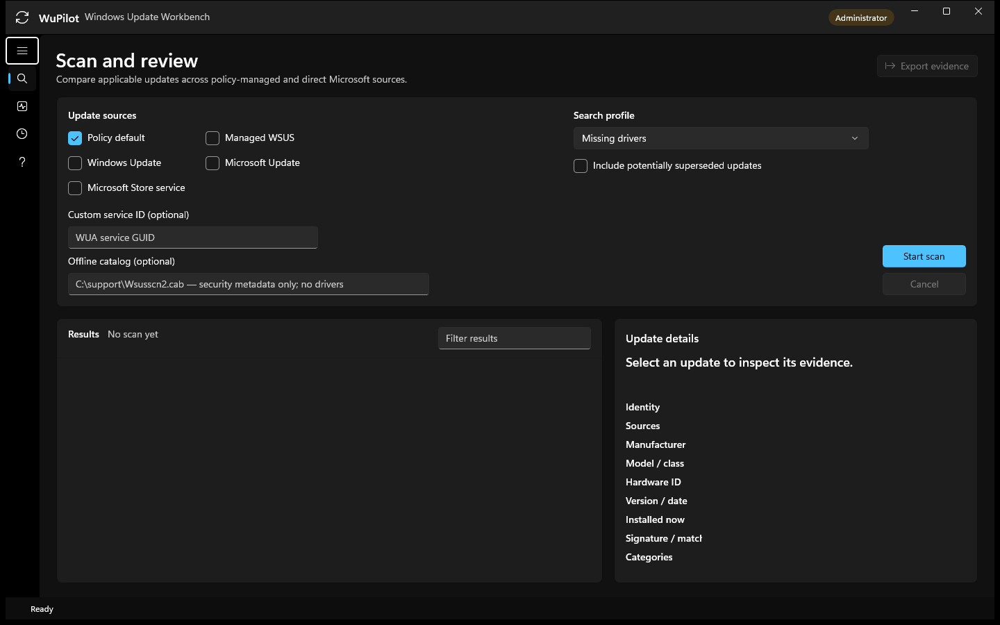
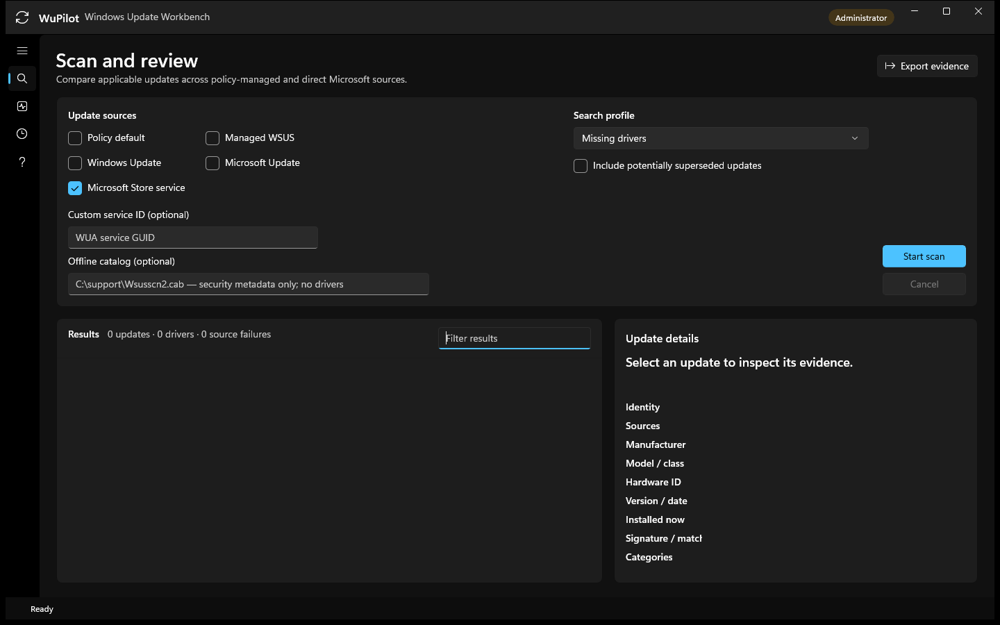
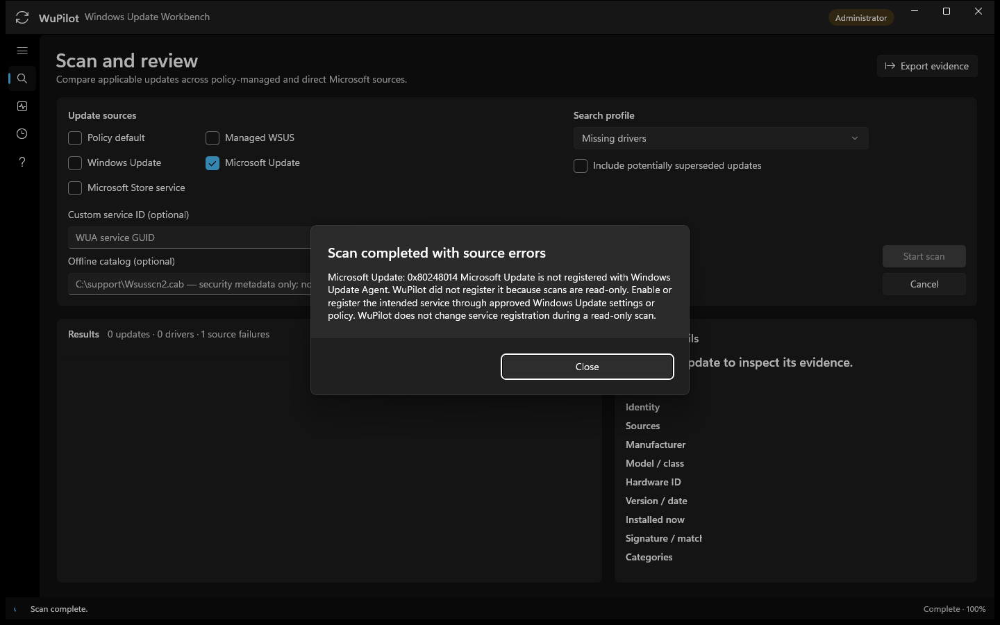
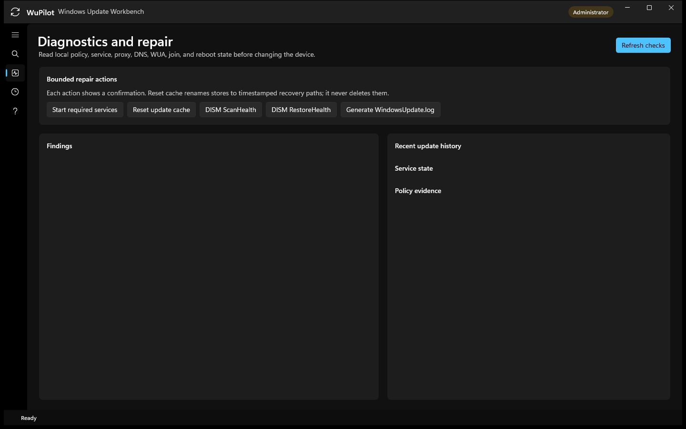
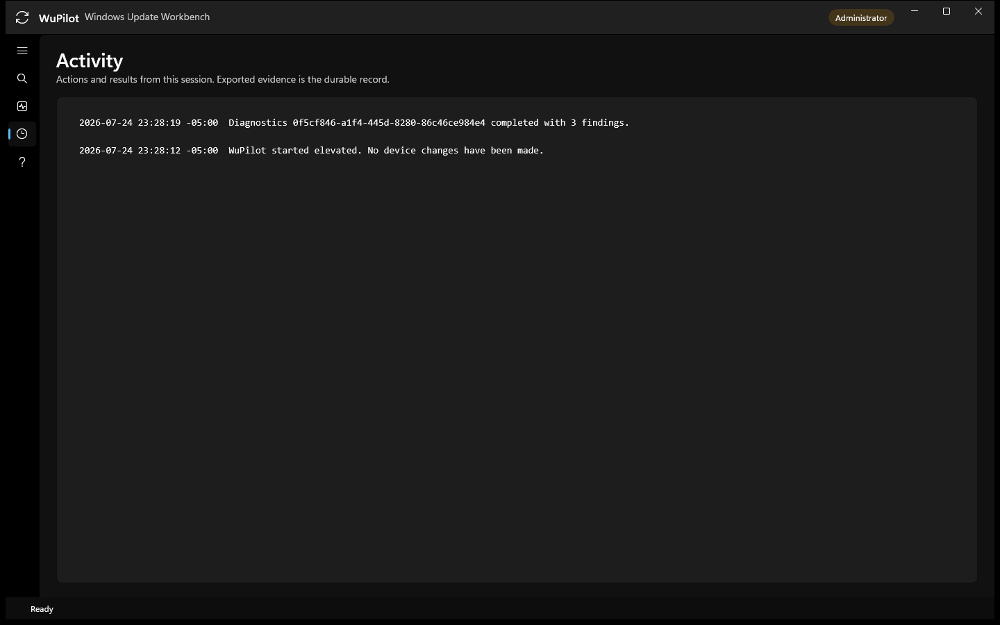
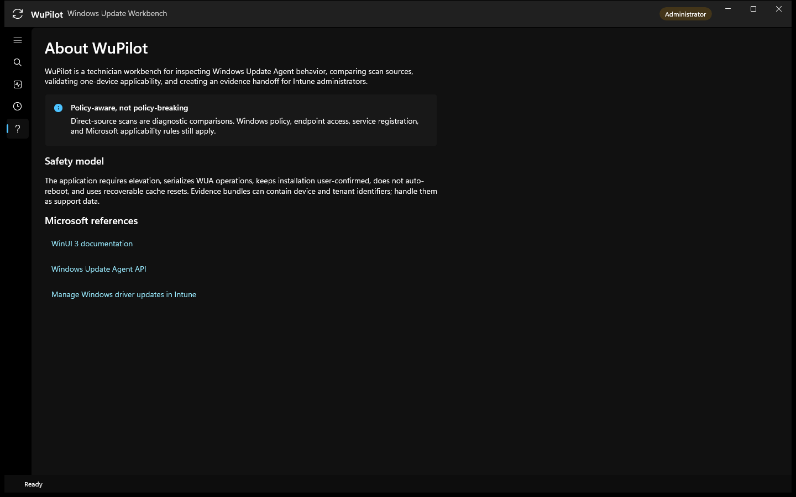

# WuPilot — Windows Update Workbench

WuPilot is an elevated WinUI 3 desktop application for support technicians who need to inspect Windows Update behavior on one device, compare update sources, test a selected update, and hand useful driver evidence to an Intune administrator.

The application uses the supported Windows Update Agent (WUA) COM API. Microsoft’s published script is a demonstration rather than production code; WuPilot wraps the same object model with serialized operations, error isolation per provider, explicit confirmations, normalized evidence, diagnostics, and recoverable repair actions.

## Current capabilities

- Scan one or several sources in sequence:
  - policy default
  - managed WSUS
  - public Windows Update
  - Microsoft Update
  - Microsoft Store service
  - a custom registered WUA service GUID
  - a Microsoft-signed offline `Wsusscn2.cab` security catalog
- Use safe presets for missing drivers, missing software, installed, hidden, all applicable, or advanced WUA criteria.
- Save reusable scan profiles that remember providers, criteria, supersedence, custom service IDs, and offline catalog paths.
- Compare/deduplicate results by WUA UpdateID and revision while retaining every source that offered the update.
- Compare the latest two scans to identify newly offered, removed, revised, and state-changed updates.
- Retry only failed providers without repeating successful source scans.
- Inspect title, description, KB/CVE IDs, categories, sizes, install state, severity, reboot behavior, and detailed driver metadata.
- Search, sort, and filter scan results by text, update kind, state, size, date, severity, and restart requirement.
- Correlate an offered driver to the currently installed signed PnP driver using exact/family hardware identifiers, including current version/date, INF, signer, and match confidence.
- Track selected updates in a persistent watchlist and see whether each one is still offered after a later scan.
- Browse and filter up to 500 local Windows Update history events, including failures and HRESULT values.
- Inspect every registered WUA source and reuse its service GUID for a custom read-only scan without registering or changing services.
- Download, install, hide, or show one revalidated update with a confirmation. WuPilot never restarts the device automatically.
- Diagnose update services, registered WUA sources, Windows Update/MDM policy registry values, WinHTTP proxy, Microsoft content DNS, WUA version/history, BITS jobs, disk space, Entra join identity, and pending restart state.
- Start required services, run DISM health operations, generate `WindowsUpdate.log`, or reset update caches. Cache reset renames existing stores to timestamped recovery paths rather than deleting them.
- Export one or several selected update records, technician notes, JSON, CSV, and a human-readable HTML review bundle plus Windows Update events, CBS errors, SetupAPI driver-install evidence, BITS state, and existing SetupDiag results.

## Quick start

WuPilot is Windows-only. Build it on Windows 10 1809 or newer with the .NET 10 SDK and Windows application development tooling installed.

```powershell
git clone https://github.com/retsak/WuPilot.git
cd WuPilot
./scripts/Build-WuPilot.ps1 -Platform x64 -Configuration Release
./artifacts/WuPilot-win-x64/WuPilot.exe
```

Accept the Windows elevation prompt when the app starts. The published application is unpackaged and self-contained; administrator rights are requested because some WUA methods and repair tools require elevation.

After launch:

1. Leave **Policy default** selected for the first scan.
2. Choose a search profile. **Missing drivers** is a useful starting point for driver troubleshooting.
3. Select **Start scan**. Scanning is read-only and may take several minutes.
4. Use the search, state filter, and sort controls to narrow the results. You can select several updates for export, but device-changing actions remain limited to one selected update.
5. Select an offered update to review its source, identity, applicability, driver match, signer, version, and date. Add it to the **Watchlist** if you need to follow it across later scans.
6. Add optional technician notes and export an evidence bundle for review.
7. Use **Download**, **Install**, **Hide**, or **Show** only after reviewing one selected update. Each action requires a separate confirmation and defaults to **Cancel**; WuPilot never restarts the device automatically.

To compare sources, select **Windows Update**, **Microsoft Update**, or **Microsoft Store service** and scan again. A source must already be registered with Windows Update Agent; WuPilot does not register services during a read-only scan.

Use **Save current** to keep a provider-and-criteria combination as a reusable scan profile. After two scans, open **Compare scans** to review what changed. If one source failed, use **Retry failed sources** to preserve successful results and re-query only the failures.

The **Registered sources** tab is a read-only inventory of WUA services already present on the device. Selecting a source can populate the custom service field for a later scan; it never calls WUA service-registration methods. **Update history** provides a searchable view of local install history, while **Watchlist** tracks whether chosen updates remain offered.

Use `-Platform ARM64` for native ARM64. The full release gate is documented in [`docs/WINDOWS-VALIDATION.md`](docs/WINDOWS-VALIDATION.md), and `scripts/Test-WuaReadOnly.ps1` provides a non-mutating WUA smoke test independent of the UI.

### 1. Start with the safe defaults

Policy default and the missing-driver profile are selected at startup. Download and Install remain unavailable until an applicable update is selected.



### 2. Run and compare scans

Select one or more registered sources, then choose **Start scan**. The results header summarizes updates, drivers, and source failures. This example completed a Microsoft Store service scan with no applicable updates.



### 3. Review source-specific guidance

Provider failures are retained alongside successful results. If Microsoft Update is not registered, WuPilot explains the condition and leaves registration unchanged instead of silently opting in the device.



### 4. Inspect diagnostics before making changes

Open **Diagnostics** from the left navigation and select **Refresh checks**. Review findings, recent update history, service state, and policy evidence before considering a repair.

The repair buttons are intentionally separate from diagnostics. Each repair action displays a confirmation first. Cache reset renames existing stores to recoverable timestamped paths, and WuPilot does not restart the device automatically.



### 5. Review session activity

Open **Activity** to review scans, diagnostics, repairs, and their results from the current session. Export an evidence bundle when a durable support record is required.



### 6. Review the safety model and references

Open **About** for WuPilot's policy boundaries, safety model, and links to the relevant WinUI, Windows Update Agent, and Intune documentation.



## Build and test

For an iterative developer build:

```powershell
dotnet restore WuPilot.slnx
dotnet test tests/WuPilot.Core.Tests/WuPilot.Core.Tests.csproj
dotnet build src/WuPilot.App/WuPilot.App.csproj -p:Platform=x64
dotnet run --project src/WuPilot.App/WuPilot.App.csproj -p:Platform=x64
```

For a tested self-contained output, use the Quick start build script; the result is written under `artifacts/`.

## Technician workflow

1. Run diagnostics before changing anything. Save policy-related findings rather than immediately “fixing” intentional management settings.
2. Scan **Policy default** first to capture the managed experience.
3. Save the scan setup as a profile when it will be reused for the same device class or support playbook.
4. For comparison, add **Windows Update**, **Microsoft Update**, or **Microsoft Store service**. Use the missing-driver preset with Windows Update to query applicable driver metadata. A direct-source scan does not defeat policy, endpoint restrictions, or Microsoft applicability rules.
5. Open **Compare scans** after another scan to distinguish newly offered updates from provider or state changes.
6. Inspect driver manufacturer, provider, model, class, hardware ID, date, inferred version, and source.
   Compare the installed driver match and confidence before concluding the offered package is an upgrade for the intended device.
7. Add important updates to the watchlist, include ticket context in technician notes, and export evidence.
8. Optionally download or install on this single test device after the confirmation. Re-scan afterward.
9. Send the evidence bundle to the Intune administrator.
10. In Intune, match on name, manufacturer, version/date, class, and applicable devices. Use a deployment ring before broad approval.

## Intune identity caveat

WUA UpdateID/revision values are excellent local trace identifiers, but they are not guaranteed to equal the Intune `windowsDriverUpdateInventory.id`. WuPilot therefore retains WUA identity and also emits the visible fields used to find and validate the same driver in Intune. Driver version is inferred from the catalog title because the WUA driver interface exposes version date but no standalone version-string property; confirm it in Intune.

## Safety boundaries

- All WUA operations are serialized. A synchronous provider search may take time and cannot always be interrupted immediately.
- Custom criteria are length-checked and reject control characters/statement separators; WUA still performs final syntax validation.
- Installation is one update at a time, applicability is rechecked, possible interactive installers are refused, and license acceptance is explicit in the confirmation.
- No automatic restart, policy mutation, driver approval, tenant write, or silent mass deployment occurs.
- Evidence can contain device serial number, Entra device ID, tenant ID, policy data, and hardware IDs. Handle it as support data.
- Offline `Wsusscn2.cab` scans cover Microsoft security applicability metadata; Microsoft documents that the catalog contains no driver metadata or update binaries.

## Project layout

- `src/WuPilot.Core` — models, criteria, merge rules, HRESULT guidance, abstractions.
- `src/WuPilot.Infrastructure.Windows` — WUA COM adapter, device diagnostics, repairs, evidence export.
- `src/WuPilot.App` — elevated WinUI 3 user interface.
- `tests/WuPilot.Core.Tests` — portable tests for provider, criteria, merging, versions, and errors.
- `tests/WuPilot.Infrastructure.Tests` — evidence-bundle integration coverage.
- `tests/WuPilot.App.CodeChecks` — compiles the real WinUI code-behind against generated-field stubs when the native XAML compiler is unavailable.
- `scripts` — Windows build and read-only WUA validation entry points.
- `docs` — architecture, Intune handoff, and troubleshooting notes.

## Microsoft references

- [WinUI 3](https://learn.microsoft.com/en-us/windows/apps/winui/winui3/)
- [Windows App SDK](https://learn.microsoft.com/en-us/windows/apps/windows-app-sdk/)
- [Using the Windows Update Agent API](https://learn.microsoft.com/en-us/windows/win32/wua_sdk/using-the-windows-update-agent-api)
- [Searching, downloading, and installing updates](https://learn.microsoft.com/en-us/windows/win32/wua_sdk/searching--downloading--and-installing-updates)
- [IUpdateSearcher search criteria](https://learn.microsoft.com/en-us/windows/win32/api/wuapi/nf-wuapi-iupdatesearcher-search)
- [IWindowsDriverUpdate](https://learn.microsoft.com/en-us/windows/win32/api/wuapi/nn-wuapi-iwindowsdriverupdate)
- [Using WUA to scan for updates offline](https://learn.microsoft.com/en-us/windows/win32/wua_sdk/using-wua-to-scan-for-updates-offline)
- [Windows Update log files](https://learn.microsoft.com/en-us/windows/deployment/update/windows-update-logs)
- [Manage Windows driver updates in Intune](https://learn.microsoft.com/en-us/intune/device-updates/windows/manage-driver-updates)
