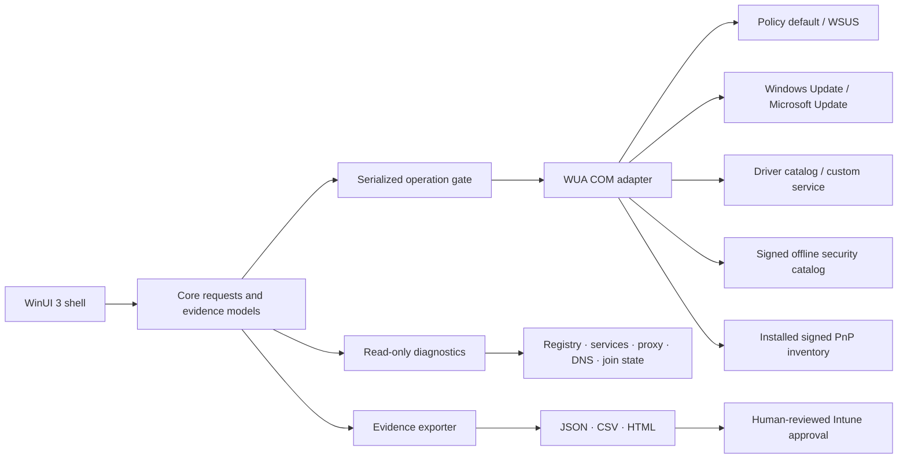

# Architecture

## Design goals

WuPilot keeps the technician experience responsive and testable without pretending WUA is a modern asynchronous API. The UI never retains COM update objects. A requested action re-queries the exact UpdateID and revision from the original provider, which revalidates applicability immediately before a download, install, hide, or show operation.

## Project boundaries

### WuPilot.Core

This project has no Windows dependency. It defines immutable scan/action/diagnostic records, provider definitions, WUA criteria presets, identity-based deduplication, HRESULT explanations, and service interfaces. Portable tests exercise the decisions most likely to corrupt evidence.

### WuPilot.Infrastructure.Windows

This project owns every Windows-only behavior:

- late-bound WUA COM creation and compatibility-safe optional-property reads;
- sequential provider searches and exact-identity action revalidation;
- installed-driver correlation via `Win32_PnPSignedDriver`, using exact or family PnP identifiers rather than manufacturer guesses;
- registry, service, proxy, DNS, WUA version/history, registered-source, BITS, disk, join-state, event, servicing-log, and pending-reboot diagnostics;
- bounded repair commands with timeouts and captured output;
- evidence serialization and the Intune review page.

Late binding avoids requiring a machine-registered WUA type library at build time. Required members fail the provider or action with an HRESULT; optional members return null so older Windows builds still produce useful evidence.

### WuPilot.App

The unpackaged, self-contained WinUI 3 process requests elevation in its manifest. It controls confirmations, cancellation intent, selection, filtering, progress, and the session activity list. The UI never makes a management-tenant change.

## Concurrency and cancellation

WUA’s synchronous `Search`, `Download`, and `Install` calls run away from the UI thread and are protected by one semaphore. Cancellation is checked before providers, while materializing results, and before action phases. It cannot forcibly abort every active COM call, so the UI accurately reports “cancellation requested” until the current call returns.

## Provider behavior

`ServerSelection` and `ServiceID` follow Microsoft’s WUA sample:

| WuPilot source | ServerSelection | Service ID |
|---|---:|---|
| Policy default | 0 | — |
| Managed WSUS | 1 | — |
| Windows Update | 2 | — |
| Microsoft Update | 3 | `7971f918-a847-4430-9279-4a52d1efe18d` |
| Driver catalog | 3 | `855e8a7c-ecb4-4ca3-b045-1dfa50104289` |
| Store | 3 | `117cab2d-82b1-4b5a-a08c-4d62dbee7782` |
| Offline security catalog | 3 | Volatile ID returned by `AddScanPackageService` |

A service can be unavailable or prohibited on a particular machine. That failure is retained beside successful provider results rather than discarding the full scan.

An offline scan registers the Microsoft-signed CAB with flags `0`, searches through the returned volatile service ID with `Online=false`, and removes/releases the registration afterward. It is deliberately non-actionable because `Wsusscn2.cab` contains security applicability metadata but no update payloads or driver inventory.

## Driver correlation

The WUA offer and the installed driver come from different inventories. WuPilot compares the offered `DriverHardwareID` and entry identifiers against the signed PnP driver’s hardware ID, compatible ID, and device-instance prefix. The exported score records how the match was made. Manufacturer/model similarity alone never creates a match because it is too weak for an approval packet.

## Future seams

The abstractions deliberately leave room for support-bundle compression/redaction profiles, inventory comparison across imported bundles, fleet-level aggregation, and an optional read-only Microsoft Graph correlation module. Tenant approval writes should remain a separate, strongly authenticated workflow.
