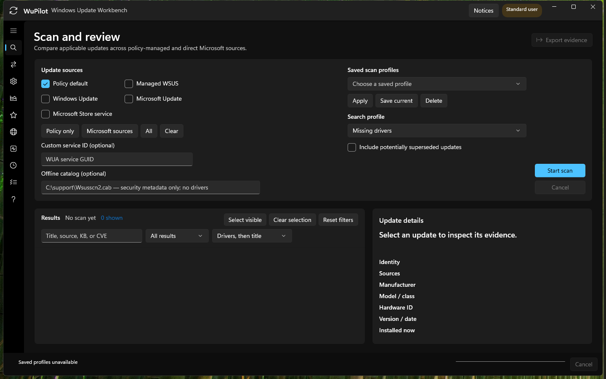

# Windows validation gate

The portable core, Windows-targeted infrastructure, serializers, and XML/PowerShell syntax can be verified from the current development host. The WinUI XAML compiler and Windows Update Agent require Windows. Do not call a release validated until the following matrix passes on representative Windows devices.

## Automated build

Run from an elevated PowerShell terminal:

```powershell
./scripts/Build-WuPilot.ps1 -Platform x64 -Configuration Release
```

Expected result: all tests pass and the self-contained output appears under `artifacts/WuPilot-win-x64`.

Before launching the UI, the read-only WUA adapter assumptions can be checked independently:

```powershell
./scripts/Test-WuaReadOnly.ps1 -Provider Default
./scripts/Test-WuaReadOnly.ps1 -Provider WindowsUpdate
./scripts/Test-WuaReadOnly.ps1 -Provider MicrosoftUpdate
./scripts/Test-WuaReadOnly.ps1 -Provider Store
./scripts/Test-WuaReadOnly.ps1 -OfflineCab C:\Support\Wsusscn2.cab -Criteria "IsInstalled=0"
```

The offline catalog contains security metadata only and is not a driver-source test.

## UI and WUA matrix

- Launch requests UAC elevation and opens the WinUI shell without activation errors.
- Policy-default missing-driver scan completes on an Intune-managed device.
- Direct Windows Update, Microsoft Update, and Store scans either complete or retain an actionable per-source registration/policy/network error.
- A multi-source scan deduplicates the same UpdateID/revision and lists every source that offered it.
- Saved scan profiles survive an application restart and restore providers, criteria, supersedence, custom service IDs, and offline catalog paths.
- A second scan populates **Compare scans** with new, removed, revision-changed, and state-changed results.
- **Retry failed sources** re-queries only failed providers and retains results from sources that already succeeded.
- Search, result-state filters, sorting, select-visible, and multi-selection export operate without enabling device-changing actions for multiple selections.
- A watched update survives an application restart and changes between offered/not-offered after subsequent scans.
- **Registered sources** lists the WUA service inventory without calling `AddService`, `AddService2`, or changing the default service.
- **Update history** loads, searches, and filters recent failures without mutating update history.
- **Update controls** reads requested/effective ownership, filters the policy catalog, build-gates private UX mappings, and keeps MDM-only CSP rows read-only.
- On a disposable unmanaged VM, normal and high-risk changes require confirmation, verify readback, create durable audit records, restore prior values, and roll back a deliberately failing multi-setting batch.
- On a domain- or MDM-managed VM, ownership and likely reversion are visible; a permitted local request never claims to have changed effective management policy when it did not.
- **Performance** reports Delivery Optimization source bytes/mode/limits, retains exact WuPilot action totals, labels event-derived durations as estimates, and leaves unmatched phase boundaries unavailable.
- A reboot-required test action persists across closure; after a normal restart, a later launch correlates shutdown/boot evidence without a service or startup task.
- Cancelling a long scan reports cancellation intent and exits after the active synchronous WUA call returns.
- A driver result displays offered metadata and a matching installed device/version/date/INF/signature when the PnP identifier is present.
- A driver with no confident identifier match is labeled as such; it must not guess by manufacturer alone.
- Diagnostics display update history, services, policy, proxy, DNS, pending reboot, disk space, BITS errors, and recent HRESULT guidance.
- Evidence export produces JSON, driver CSV, history CSV, HTML, event data, registered WUA services, BITS state, CBS errors, SetupAPI tail, and SetupDiag results when present.
- Technician notes and every explicitly selected update appear in the evidence bundle.
- Download on a disposable test VM revalidates the selected UpdateID/revision and does not install.
- Install on a disposable test VM requires confirmation, refuses interactive installers, records HRESULT/result/reboot state, and never restarts automatically.
- Hide/show changes local WUA visibility only and is corrected by a rescan.
- Cache reset on a disposable VM creates timestamped recovery paths and restarts required services without deleting the old stores.
- x64 and ARM64 publish outputs launch on their corresponding architecture.
- The x64 and ARM64 installers display the expected version and architecture, install under Program Files, create the selected shortcuts, launch WuPilot through UAC, upgrade in place, and uninstall cleanly.
- The automatic stable-update task defaults on, can be disabled during setup, and persists the machine preference without adding a background process.
- Upgrading from the previous public release selects the native installer, requires confirmation, rejects a wrong checksum or architecture, warns for unsigned payloads, preserves the icon, and retains LocalAppData audit/metric state.
- Window placement, page, theme, scan setup, result filters, performance range, policy filters, favorites, and taskbar preference survive a normal relaunch; placement is clamped after removing or rearranging a monitor.
- Scan results, selected updates, technician notes, and staged policy changes do not reappear after relaunch.
- Ctrl+1/2/3, Ctrl+F, F5, Ctrl+Enter, Esc, and Ctrl+Shift+E work in their documented contexts and never bypass confirmations.
- Long operations keep global stage/percent/elapsed progress visible while navigating; taskbar state follows running, paused, failed, and acknowledged states.
- Closing during WUA or diagnostics work offers Keep running or Request cancellation and does not terminate the synchronous call.
- Completion notices survive relaunch for 30 days, retain at most 50 entries, navigate to the originating page, and contain no device evidence.
- Policy favorites and combined filters persist; typed editors reject invalid values; staged batches reject drift, verify success, and retain the cart after rollback.
- Silent installation with `/VERYSILENT /SUPPRESSMSGBOXES /NORESTART` returns success and leaves WuPilot available from the Start Menu.
- Release SHA-256 files match the downloadable installer assets, and Authenticode signatures validate when signing secrets are configured.

### Quality-of-life validation captures

The July 25, 2026 Windows validation run captured the restored workflow shell, typed policy change cart, cross-page operation progress, retained completion center, and restored Performance navigation state:




## Intune acceptance

Give the exported HTML/CSV bundle to an Intune administrator and verify that the same driver can be found using name, manufacturer, offered version/date, class, and applicable devices. Confirm that WUA UpdateID is treated as local trace evidence rather than assumed to be the Intune inventory ID. Approval and broad deployment must remain outside WuPilot and use an Intune test ring.
